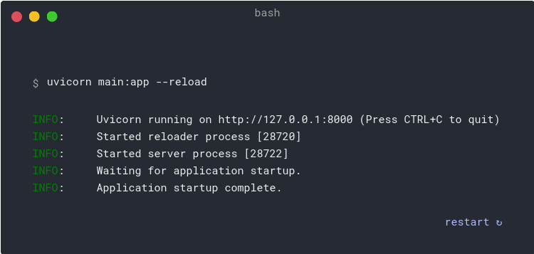

# Calender_app

# Table of contents. 
* Introduction
* Usage
* Pre-requisites
* Run the live server
* AUTHORS
## Introduction
In this project, we are developing full clone of Calender web app.

## Usage
Clone the repository with the following command
*   git clone https://github.com/bolexs/fix_friends.git

## Pre-requisites
    python3 -m install fastapi
    python3 install pip fastapi
    pip install uvicorn

## Run the live server:

    
    The command uvicorn main:app refers to:

    main: the file main.py (the Python "module").
    app: the object created inside of main.py with the line app = FastAPI().
    --reload: make the server restart after code changes. Only use for development.

## Requests
    POST: to create data.
    GET: to read data.
    PUT: to update data.
    DELETE: to delete data.

## AUTHORS
* **Justin Akinyi**
<justakinyi1@gmail.com>
and many others